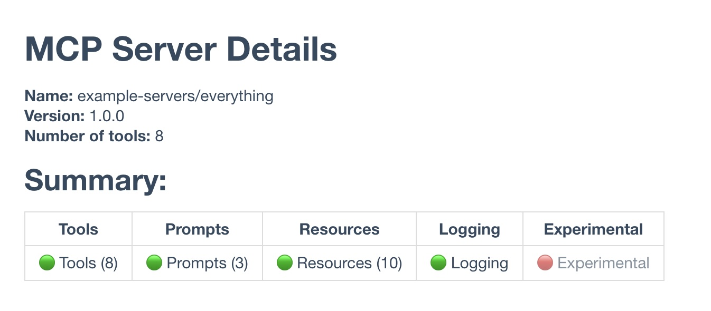

<p align="center">
  
</p>

# MCP Discovery

A command-line tool written in Rust for discovering and documenting MCP Server capabilities.

`mcp-discovery` launches an MCP Server using provided commands, queries its capabilities, tools, resources etc.
It supports outputting the results in the terminal or saving them to files in Markdown, HTML, or plain text formats.

This project is open-source and leverages the [rust-mcp-schema](https://github.com/rust-mcp-stack/rust-mcp-schema) and [rust-mcp-sdk](https://github.com/rust-mcp-stack/rust-mcp-sdk) crates for seamless interaction with MCP Servers.

Check the [project documentation](https://rust-mcp-stack.github.io/mcp-discovery) for instructions and [command examples](https://rust-mcp-stack.github.io/mcp-discovery/#/guide/command-examples).

## Features 💡

- **Display MCP Details**: Output MCP Server information, including tools, resources, and capabilities, directly to the terminal.
- **Generate Files**: Create files in Markdown (`.md`), HTML (`.html`), or plain text (`.txt`) formats with MCP Server details and capabilities.
- **Update Files**: Modify existing Markdown, HTML, or text files by adding MCP Server capabilities within specified markers, enabling MCP Server developers to automatically maintain up-to-date documentation and repository README files.
- **Flexible Output Customization**: Choose from built-in templates (`md`, `md-plain`, `html`, `txt`) or supply custom Handlebars templates for personalized output.

## Installation ⬇️

Check the [project documentation](https://rust-mcp-stack.github.io/mcp-discovery) for instructions on installing the tool on different platforms.

## Subcommands

- **`print`**: Displays MCP Server capabilities in the terminal.
- **`create`**: Creates a new file with MCP Server capability details.
- **`update`**: Updates an existing file by inserting MCP Server capabilities between specified
  markers.

👉 Note: If no subcommand is provided, the `print` subcommand will be used by default.

### Options ⚙️

- `-f, --filename <FILENAME>`: Used with `create` and `update` commands to specify the output file to generate or modify.
- `-t, --template <TEMPLATE>`: Choose a built-in output template. Options: `md`, `md-plain`, `html`, `txt`.
- `-p, --template-file <TEMPLATE_FILE>`: Path to a custom Handlebars template file.
- `-s, --template-string <TEMPLATE_STRING>`: Inline Handlebars template provided as a string.
- `-h, --help`: Display help information.
- `-V, --version`: Display the version of `mcp-discovery`.

👉 Note: If no template is provided, `mcp-discovery` will automatically select the most suitable built-in template based on the file extension.

## Built-in Templates 🧬

The CLI supports the following built-in output templates:

- **`md`**: Formatted Markdown that presents MCP Server capabilities in a table format.
- **`md-plain`**: Minimalist Markdown for straightforward output, using plain text instead of tables.
- **`html`**: Structured HTML with basic styling.
- **`txt`**: Plain text for raw, unformatted output.

## Custom Templates 🧩

You can provide custom Handlebars templates in different ways:

1.  Use the `--template-file` flag to provide a custom template file.
2.  Use the `--template-string` flag to provide a raw Handlebars template directly as a string.
3.  To use an inline template, define it in a file for the `update` command only — <i>this will not function with print or create.</i>

> Inline templates must be enclosed within designated marker annotations.

### Examples

##### Print MCP Server capabilities to the terminal:

```bash
mcp-discovery -- npx -y @modelcontextprotocol/server-everything
```

#### Create a HTML file with MCP Server capabilities:

```bash
mcp-discovery create -f capabilities.html -- npx -y @modelcontextprotocol/server-everything
```

<b>📄</b> <a href="https://rust-mcp-stack.github.io/mcp-discovery/examples/server-info.html" target="_blank"> Click here to view generated html file</a>

#### Create a MD file with MCP Server capabilities:

```bash
mcp-discovery create -f capabilities.md -- npx -y @modelcontextprotocol/server-everything
```

#### Use a custom Handlebars template:

```bash
mcp-discovery create -f capabilities.md  --template-file=custom_template.hbs -- npx -y @modelcontextprotocol/server-everything
```

💡 See the [Command Examples](https://rust-mcp-stack.github.io/mcp-discovery/#/guide/command-examples) section in the project documentation for additional CLI usage examples.

## Defining Update Regions with Markers

When using the `update` subcommand, `mcp-discovery` places capabilities between designated markers in the target file, which vary by file format and are typically comment lines.  
The update command simplifies the process for developers and maintainers to keep documentation current effortlessly.  
Run the mcp-discovery update command anytime to refresh the file with the latest MCP Server capabilities.

### Marker Annotations

- **Render Block Start** : **`mcp-discovery-render`**
- **Render Block End** : **`mcp-discovery-render-end`**

**👉** The mcp-discovery-render marker supports template and template-file properties as well. Check the examples below for details.

You can optionally include an inline template identifier within the render block, enclosed by:

- **Template Block Start**: **`mcp-discovery-template`**
- **Template Block End**: **`mcp-discovery-template-end`**

If a template annotation is detected within a render block, `mcp-discovery` will use it to render the output. This allows for customized templates without depending on built-in or external template files. Check the examples below for details:

### Sample Markdown file annotated with render block:

```md
# Server Info and Capabilities

<!-- mcp-discovery-render -->

Server Capabilities will be placed here...

<!-- mcp-discovery-render-end -->
```

### Sample Markdown file, annotated with render block and template name:

```md
# Server Info and Capabilities

<!-- mcp-discovery-render template=md-plain -->

Server Capabilities will be placed here...

<!-- mcp-discovery-render-end -->
```

### Sample Markdown file, annotated with render block and custom template file:

```md
# Server Info and Capabilities

<!-- mcp-discovery-render template=my-custom-template.hbs -->

Server Capabilities will be placed here...

<!-- mcp-discovery-render-end -->
```

### Sample HTML file with annotations :

```html
<!DOCTYPE html>
<html lang="en">
  <head>
    <title>My MCP Server</title>
  </head>
  <body>
    <h1>MCP Server Details</h1>
    <div>
      <!-- mcp-discovery-render -->

      <!-- mcp-discovery-render-end -->
    </div>
  </body>
</html>
```

### Sample HTML file with inline template :

```html
<h1>MCP Server Details</h1>
<div>
  <!-- mcp-discovery-render -->
  <!-- mcp-discovery-template
    <b>Name: </b>{{name}}
    <br/>
    <b>Version: </b>{{version}}
    <br/>      
    <b>Number of tools:</b> {{len tools}}
    <h2>Summary:</h2>
    {{> html-summary }}
    mcp-discovery-template-end -->
  <!-- mcp-discovery-render-end -->
</div>
```

Below is a screenshot showing the resulting HTML after the mcp-discovery update command is executed:



> You can execute the mcp-discovery update command whenever you need to refresh the file with the latest MCP Server capabilities.

## Contributing

We welcome everyone who wishes to contribute! Please refer to the [contributing](CONTRIBUTING.md) guidelines for more details.

All contributions, including issues and pull requests, must follow
Rust's Code of Conduct.

Unless explicitly stated otherwise, any contribution you submit for inclusion in mcp-discovery is provided under the terms of the MIT License, without any additional conditions or restrictions.

## License

This project is licensed under the MIT License. see the [LICENSE](LICENSE) file for details.
